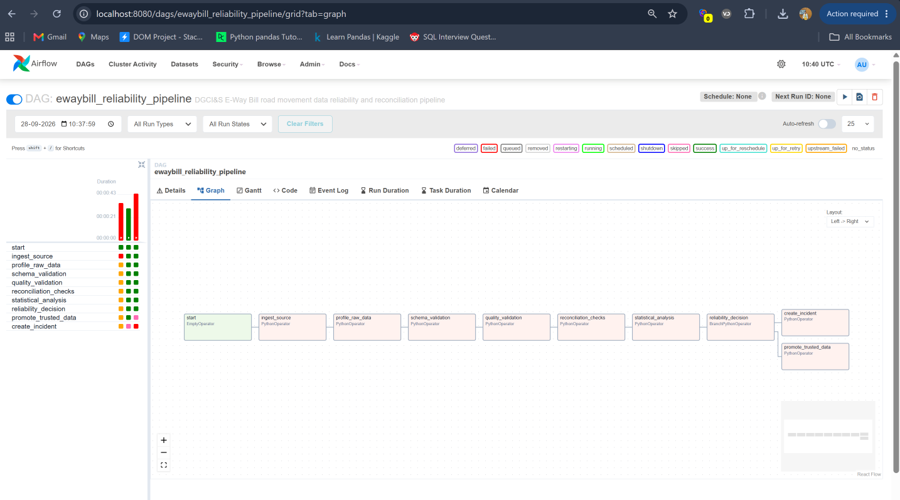
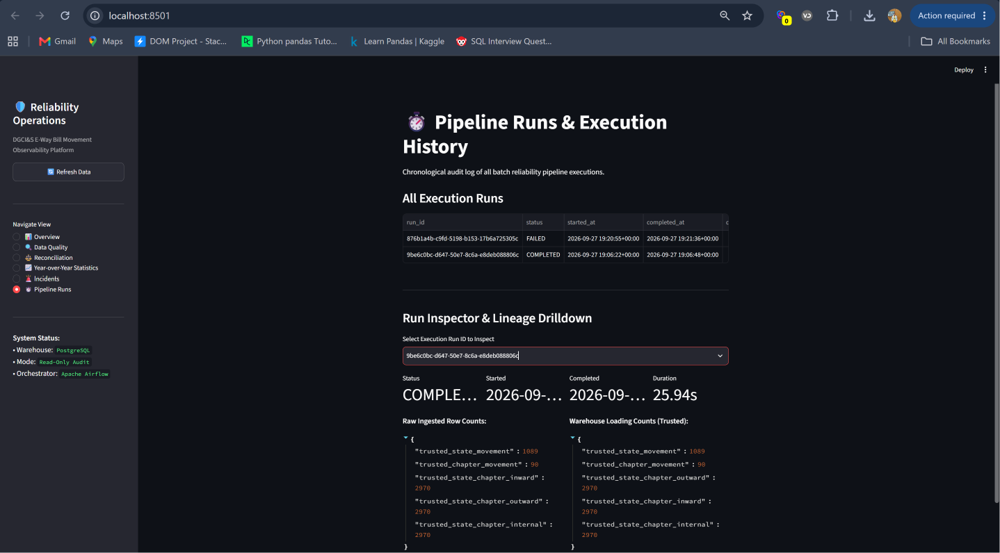
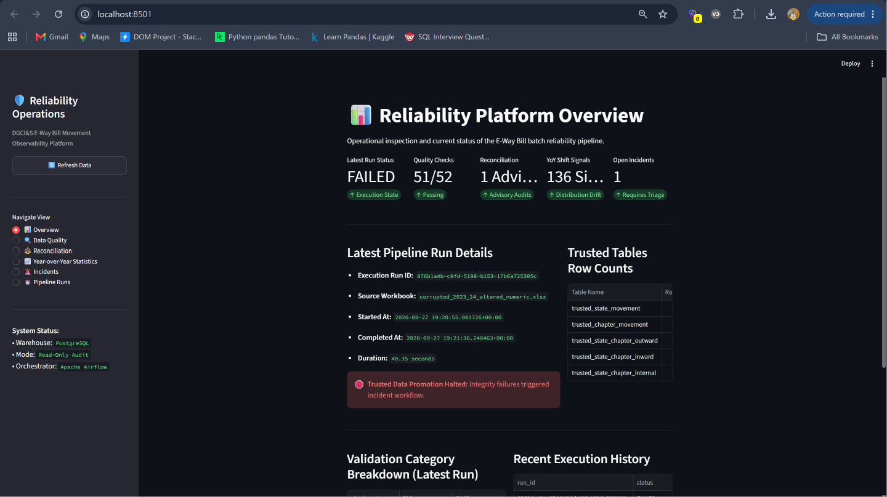
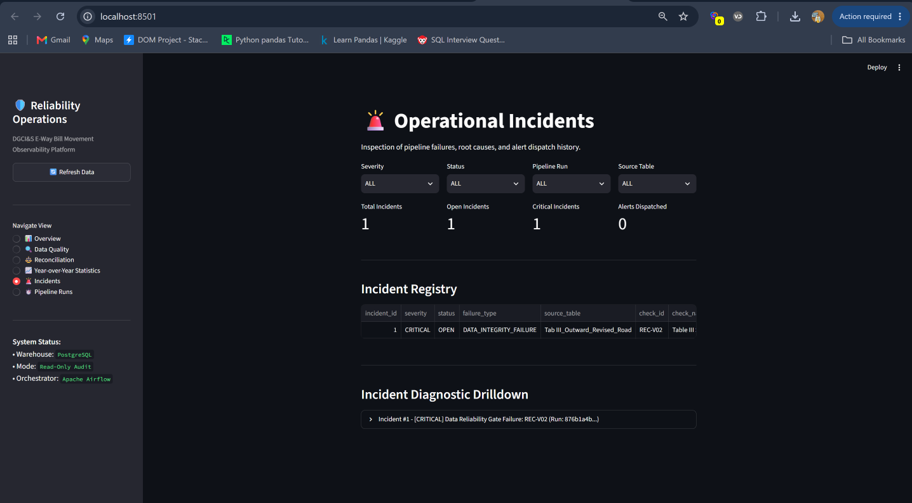

# DGCI&S Road E-Way Bill Data Reliability & Reconciliation Pipeline

An end-to-end data reliability and reconciliation pipeline for the DGCI&S Road E-Way Bill statistical datasets for FY 2022–23 and FY 2023–24.

The project validates published Excel workbooks before analytical use by checking schema integrity, data quality, source totals, cross-table reconciliation, and cross-year statistical changes. A reliability gate determines whether the validated data can be promoted into trusted PostgreSQL tables or whether an incident should be created.

---

## Overview

Government and regulatory datasets are often published as multi-sheet Excel workbooks intended primarily for human consumption. Before such data is used for analysis, it is important to establish that the source is structurally valid, internally consistent, and suitable for comparison with the relevant historical snapshot.

This project implements that reliability layer.

Instead of loading the published workbook directly into trusted analytical storage, the pipeline evaluates it through multiple validation stages:

```text
DGCI&S E-Way Bill Workbooks
            │
            ▼
      Data Ingestion
            │
            ▼
 Schema & Quality Validation
            │
            ▼
 Cross-Table Reconciliation
            │
            ▼
 Cross-Year Statistics
            │
            ▼
       Reliability Gate
          /        \
       PASS         FAIL
        │             │
        ▼             ▼
Trusted Data       Incident
        │
        ▼
   PostgreSQL
        │
        ▼
Streamlit Dashboard
```

The project focuses on **data reliability and analytical trust**, rather than real-time processing, individual E-Way Bill transaction processing, or fraud detection.

---

## Architecture

```text
                         SOURCE WORKBOOKS
                    FY 2022–23 / FY 2023–24
                              │
                              ▼
                  ┌───────────────────────┐
                  │ Python / Pandas       │
                  │ Data Ingestion        │
                  │ Source Hashing        │
                  └───────────┬───────────┘
                              │
                              ▼
                  ┌───────────────────────┐
                  │ PostgreSQL            │
                  │ Raw / Staging Data    │
                  └───────────┬───────────┘
                              │
                              ▼
             ┌─────────────────────────────────┐
             │ Reliability Evaluation          │
             │                                 │
             │ • Schema Validation             │
             │ • Data Quality Checks            │
             │ • Source-Total Validation        │
             │ • Cross-Table Reconciliation     │
             │ • KS / PSI / Cross-Year Analysis │
             └───────────────┬─────────────────┘
                             │
                             ▼
                    ┌─────────────────┐
                    │ Reliability     │
                    │ Gate            │
                    └───────┬─────────┘
                       PASS │ FAIL
                    ┌────────┘ └─────────┐
                    ▼                    ▼
             Trusted Promotion      Incident Management
                    │                    │
                    ▼                    ▼
             Trusted PostgreSQL      Incident Record
                    │
                    ▼
             Read-Only Streamlit
                 Dashboard
```

### Airflow orchestration

The batch pipeline is orchestrated using Apache Airflow.

```text
start
  │
  ▼
ingest_source
  │
  ▼
profile_raw_data
  │
  ▼
schema_validation
  │
  ▼
quality_validation
  │
  ▼
reconciliation_checks
  │
  ▼
statistical_analysis
  │
  ▼
reliability_decision
      │
      ├──────────────► promote_trusted_data
      │
      └──────────────► create_incident
```

The Airflow DAG handles orchestration and task dependencies while the core validation, reconciliation, statistical, and incident logic remains in `src/`.

> **Screenshot — Airflow DAG**
>
> 

---

## Data Source

The source data consists of DGCI&S Road E-Way Bill published statistics for FY 2022–23 and FY 2023–24.

The pipeline works with five published views:

| View | Source Sheet | Structure | Purpose |
|---|---|---|---|
| Table I | `Tab I_Stat_to_Stat_Revised_Road` | 33 × 33 | State-to-state movement matrix |
| Table II | `Tab II_Chap_Revised_Road` | 90 × 4 | National chapter summary |
| Table III | `Tab III_Outward_Revised_Road` | 90 × 33 | Chapter × state outward movement |
| Table IV | `Tab IV_Inward_Revised_Road` | 90 × 34 | Chapter × state inward movement |
| Table V | `Tab V_Internal_Revised_Road` | 90 × 34 | Chapter × state internal movement |

The raw source structure and labels are preserved. Controlled mappings are applied only where required for historical comparison.

### Historical comparability

The FY2022–23 and FY2023–24 workbooks share the same core analytical structures, but several source-label differences require controlled adaptations:

- `CHHATTISGARH` → `CHATTISGARH`
- `JAMMU AND KASHMIR` → `JAMMU & KASHMIR`
- `Other Territory` → `OTHER TERRITORY`

The chapter descriptions are character-for-character identical across the two annual snapshots.

Table III also has a structural difference: FY2022–23 contains a published `TOTAL` column that is omitted in FY2023–24. Comparable totals are therefore recalculated from the state columns rather than directly comparing the two source layouts.

---

## Reliability Framework

### 1. Schema Validation

The pipeline verifies the expected workbook structure before analytical processing.

Checks include:

- Required worksheets
- Expected columns
- Header structure
- Expected dimensions
- Required fields
- Data types
- Source layout consistency

---

### 2. Data Quality Validation

The quality layer checks for deterministic integrity issues such as:

- Missing expected records
- Duplicate logical records
- Invalid state or jurisdiction names
- Invalid chapter codes
- Negative or invalid numeric values
- Unexpected data types
- Missing values
- Structural inconsistencies
- Source-reported total mismatches

The validation framework records individual check results and associates failures with their corresponding check IDs.

---

### 3. Cross-Table Reconciliation

Cross-table reconciliation is a core part of the project.

The pipeline does not treat each published table as an isolated dataset. Instead, it evaluates relationships between the different published views.

Key reconciliation checks include:

| Check | Description |
|---|---|
| `REC-DO01` | Table I matrix total vs. Table II national total |
| `REC-DO02` | Table III outward total vs. Table IV inward total |
| `REC-DO03` | Table II relationships with outward, inward, and internal movement |
| `REC-DO04` | State-level column marginals |
| `REC-DO05` | State-level row marginals |
| `REC-DO06` | State-level diagonal/internal movement reconciliation |

Every reconciliation result records the expected value, observed value, difference, tolerance, and status.

### `OTHER TERRITORY`

The FY2023–24 `OTHER TERRITORY` reconciliation remains unresolved.

The source methodology does not provide sufficient information to explain the observed difference. Therefore, the pipeline records the condition as `UNRESOLVED` rather than inventing a cause or forcing it into a pass/fail interpretation.

Under the current governance rules, this is a **non-blocking advisory**.

---

## Cross-Year Statistical Analysis

FY2022–23 is used as the historical reference snapshot and FY2023–24 as the comparison snapshot.

The statistical layer includes:

- Two-sample Kolmogorov-Smirnov (KS) tests
- Population Stability Index (PSI)
- State-level annual differences
- Chapter-level annual differences
- Zero-denominator safeguards

### Statistical interpretation

Statistical change is treated as a monitoring signal rather than evidence of corruption or a data-quality failure.

PSI uses project-configured interpretation thresholds and is treated as a descriptive distribution-shift measure between annual snapshots rather than a universal data-quality standard.

The state × chapter KS analysis also accounts for the structured and dependent nature of the underlying matrix. Its statistical results are therefore interpreted as descriptive signals rather than independent-population inference.

### Observed differences between annual snapshots

| Measure | FY2022–23 | FY2023–24 | Observed Difference |
|---|---:|---:|---:|
| Outward | ₹62,999,856.01 Cr | ₹10,429,324.40 Cr | -83.45% |
| Inward | ₹62,999,856.01 Cr | ₹10,429,324.40 Cr | -83.45% |
| Internal | ₹31,353,408.74 Cr | ₹9,890,462.58 Cr | -68.45% |
| National Total | ₹94,353,264.75 Cr | ₹20,319,786.98 Cr | -78.46% |

These percentages are calculated differences between the two published annual snapshots. They are not treated as verified year-over-year economic or reporting trends. The pipeline does not attribute the differences to a specific economic, methodological, or causal explanation.

---

## Reliability Gate

The reliability gate separates **blocking integrity failures** from **advisory signals**.

### Blocking failures

Examples include:

- Schema failures
- Missing expected records
- Duplicate logical records
- Invalid domain values
- Numeric integrity failures
- Source-total mismatches
- Blocking reconciliation failures

When a blocking failure occurs:

```text
Reliability Gate = FAIL
        │
        ├── Trusted promotion blocked
        │
        └── Incident workflow triggered
```

### Advisory conditions

Examples include:

- Unresolved `OTHER TERRITORY` reconciliation
- Statistical distribution changes
- Cross-year magnitude differences where comparability has not been independently established

These conditions are retained in the audit trail but do not automatically block trusted promotion.

A clean execution follows:

```text
Reliability Gate = PASS
        │
        ▼
Promote validated data
        │
        ▼
trusted_* PostgreSQL tables
```

---

## Verified End-to-End Results

The pipeline was verified using genuine Airflow executions against the local PostgreSQL warehouse.

### Clean run

The clean run completed successfully with:

- Airflow run: `manual__2026-09-27T19:06:19+00:00`
- Reliability gate: `PASS`
- Validation evaluations: 52
- Reconciliation records: 103
- Statistical results: 204
- Trusted rows promoted: **10,089**
- Incidents created: **0**
- Official source hash verified

### Controlled failure run

A separate execution used an isolated corrupted copy of the FY2023–24 workbook.

The run:

- Detected a ₹500 Cr controlled alteration
- Failed `REC-V02`
- Classified the failure as blocking
- Set the reliability gate to `FAIL`
- Prevented trusted-data promotion
- Created one CRITICAL incident
- Preserved the clean run and official source data

### End-to-end summary

| Metric | Clean Run | Controlled Failure Run |
|---|---:|---:|
| Run state | `success` | `failed` |
| Validation evaluations | 52 | 52 |
| Reconciliation | 99 PASS, 4 advisory/unresolved, 0 FAIL | 99 PASS, 4 advisory/unresolved, 1 FAIL |
| Statistical results | 204 | 204 |
| Reliability gate | `PASS` | `FAIL` |
| Trusted rows promoted | **10,089** | **0** |
| Incidents | 0 | **1 CRITICAL** |
| Corrupted data promoted | No | **No** |

> **Screenshot — Clean Run**
>
> 

> **Screenshot — Failure Run**
>
> 
---

## Controlled Corruption Testing

The project includes isolated corruption simulations to verify that configured validation rules respond to specific defects.

Seven scenarios were tested:

| Scenario | Injected Defect | Detection | Result |
|---|---|---|---|
| `CORRUPT-A` | Missing state/chapter record | Completeness | BLOCKED |
| `CORRUPT-B` | Duplicate logical record | Uniqueness | BLOCKED |
| `CORRUPT-C` | Invalid chapter code | Domain validation | BLOCKED |
| `CORRUPT-D` | +₹500 Cr movement alteration | Source-total validation | BLOCKED |
| `CORRUPT-E` | Missing Bihar column | Completeness + reconciliation | BLOCKED |
| `CORRUPT-F` | Numeric value replaced with text | Numeric validation | BLOCKED |
| `CORRUPT-G` | Controlled distribution shift | KS + PSI | ADVISORY |

All corruption tests operate on isolated copies or in-memory data.

The official source workbook remains unchanged.

These tests demonstrate the sensitivity of the configured rules to the tested scenarios. They do not constitute a guarantee of universal corruption detection.

---

## Incident Management

When a blocking reliability failure occurs, the pipeline creates an incident record.

An incident contains information such as:

- Incident ID
- Pipeline run ID
- Severity
- Failure type
- Source table
- Check ID
- Check name
- Expected value
- Observed value
- Difference
- Affected record count
- Failure description
- Triggering failures
- Timestamps
- Alert status

### Incident severity

```text
CRITICAL
   │
ERROR
   │
WARNING
```

Only blocking `CRITICAL` or `ERROR` failures trigger the incident workflow.

Email notification is optional and configured through environment variables. The database incident record remains authoritative if notification is disabled or unavailable.

> **Screenshot — Incident**
>
> 
---

## Streamlit Dashboard

The project includes a read-only Streamlit dashboard connected to PostgreSQL.

### Dashboard pages

#### Overview

Shows:

- Latest pipeline run
- Run status
- Validation results
- Reconciliation status
- Statistical signals
- Open incidents
- Trusted-data counts

#### Data Quality

Provides filtered views of:

- Validation checks
- Check IDs
- Expected values
- Observed values
- Statuses

#### Reconciliation

Shows:

- Reconciliation checks
- Differences
- Tolerances
- PASS / FAIL / UNRESOLVED results
- Source-table context

#### Year-over-Year Statistics

Displays:

- KS results
- PSI results
- Annual differences
- Statistical interpretation notes

#### Incidents

Provides:

- Incident history
- Severity
- Status
- Failure type
- Triggering check
- Failure details

#### Pipeline Runs

Shows:

- Run IDs
- Execution status
- Start/end timestamps
- Duration
- Source workbook
- Validation counts
- Reconciliation counts
- Statistical counts
- Trusted row counts

### Dashboard safety

The dashboard is intentionally read-only.

It does not:

- Modify incidents
- Resolve incidents
- Trigger Airflow runs
- Insert warehouse data
- Update warehouse data
- Delete warehouse data
- Alter database schema

> **Screenshot — Dashboard Overview**
>
> 
---

## Local Runtime Architecture

Docker Compose provides the local Airflow and PostgreSQL environment.

```text
Local Windows Machine
┌─────────────────────────────────────┐
│                                     │
│  Streamlit     pytest     scripts   │
│      │            │          │      │
│      └────────────┼──────────┘      │
│                   │                 │
│             127.0.0.1:5434         │
│                   │                 │
└───────────────────┼─────────────────┘
                    ▼
          ┌─────────────────────┐
          │ Docker PostgreSQL   │
          │                     │
          │ Internal: 5432      │
          │ Host:     5434      │
          └──────────▲──────────┘
                     │
                     │ postgres:5432
                     │
          ┌──────────┴──────────┐
          │ Docker Airflow      │
          │                     │
          │ Scheduler           │
          │ Webserver           │
          └─────────────────────┘
```

The host machine connects to PostgreSQL through port `5434`.

Airflow containers connect internally through the Docker service name:

```text
postgres:5432
```

---

## Quickstart

### Prerequisites

Install:

- Python 3.12+
- Docker Desktop
- Git

Docker Desktop must be running before starting the Airflow environment.

### 1. Clone the repository

```bash
git clone https://github.com/Saksham3124/ewaybill-data-reliability-pipeline.git
cd ewaybill-data-reliability-pipeline
```

### 2. Create a Python environment

#### Windows PowerShell

```powershell
python -m venv .venv
.\.venv\Scripts\Activate.ps1
pip install -r requirements.txt
```

#### Linux / macOS

```bash
python -m venv .venv
source .venv/bin/activate
pip install -r requirements.txt
```

### 3. Build the Airflow image

```bash
docker compose build --no-cache
```

The Airflow image installs the pinned runtime dependencies defined in:

```text
requirements-airflow.txt
```

### 4. Start the Docker environment

```bash
docker compose up -d
```

Check the services:

```bash
docker compose ps
```

### 5. Open Airflow

Open:

```text
http://localhost:8080
```

The DAG is:

```text
ewaybill_reliability_pipeline
```

Trigger it from the Airflow UI or with:

```bash
docker compose exec airflow-scheduler airflow dags trigger ewaybill_reliability_pipeline
```

### 6. Run the test suite

```bash
pytest -v
```

The verified repository state contains:

```text
125 passed, 0 failed, 1 warning
```

### 7. Start Streamlit

```bash
streamlit run dashboard/app.py
```

Open:

```text
http://localhost:8501
```

---

## Run It Yourself

A typical local execution looks like:

```text
1. Start Docker
       │
       ▼
2. Start PostgreSQL + Airflow
       │
       ▼
3. Trigger Airflow DAG
       │
       ▼
4. Watch task execution
       │
       ▼
5. Reliability Gate
       │
       ├── PASS → trusted data
       │
       └── FAIL → incident
       │
       ▼
6. Open Streamlit
       │
       ▼
7. Inspect pipeline results
```

### Useful Docker commands

Check running services:

```bash
docker compose ps
```

View scheduler logs:

```bash
docker compose logs -f airflow-scheduler
```

View webserver logs:

```bash
docker compose logs -f airflow-webserver
```

Stop the environment:

```bash
docker compose down
```

Stop and remove the local database volume as well:

```bash
docker compose down -v
```

> `docker compose down -v` removes the Docker PostgreSQL volume and therefore removes the locally persisted warehouse data.

---

## Project Structure

```text
ewaybill-data-reliability/
│
├── dags/
│   └── ewaybill_reliability_pipeline.py
│
├── dashboard/
│   ├── app.py
│   └── data_access.py
│
├── data/
│   ├── Road_EwayBill_2022_23.xlsx
│   └── Road_EwayBill_2023_24.xlsx
│
├── docs/
│   ├── end_to_end_verification.md
│   ├── final_verification_summary.md
│   ├── corruption_detection_report.md
│   ├── corruption_test_spec.md
│   ├── incident_management.md
│   ├── reconciliation_report.md
│   ├── statistical_analysis_report.md
│   └── validation_report.md
│
├── sql/
│   ├── schema.sql
│   └── init_multiple_dbs.sh
│
├── src/
│   ├── corruption/
│   ├── database/
│   ├── incidents/
│   ├── ingestion/
│   ├── notifications/
│   ├── reconciliation/
│   ├── statistics/
│   ├── transformation/
│   └── validation/
│
├── tests/
│
├── Dockerfile
├── docker-compose.yaml
├── pytest.ini
├── requirements.txt
└── requirements-airflow.txt
```

---

## Technology Stack

| Layer | Technology |
|---|---|
| Programming | Python |
| Data processing | Pandas, NumPy |
| Statistical analysis | SciPy |
| Excel ingestion | openpyxl |
| Database | PostgreSQL |
| Orchestration | Apache Airflow |
| Containerization | Docker, Docker Compose |
| Dashboard | Streamlit |
| Testing | pytest |
| Version control | Git / GitHub |

---

## Database Design

The PostgreSQL warehouse separates source, validation, reconciliation, statistical, incident, and trusted-data layers.

Important tables include:

```text
Raw / Source
├── raw_*
│
Validation
├── validation_results
│
Reconciliation
├── reconciliation_results
│
Statistics
├── statistical_results
│
Pipeline Monitoring
├── pipeline_runs
│
Incident Management
├── incidents
│
Trusted Data
├── trusted_state_movement
├── trusted_chapter_movement
├── trusted_state_chapter_outward
├── trusted_state_chapter_inward
└── trusted_state_chapter_internal
```

The trusted tables are populated only after the reliability gate permits promotion.

---

## Testing

The repository contains automated tests covering:

- Historical source profiling
- Ingestion
- Normalization
- Validation engine
- Validation rules
- Reconciliation engine
- Statistical analysis
- Corruption simulation
- Airflow DAG behavior
- Incident management
- Notifications
- Dashboard behavior
- Database configuration

Verified test state:

```text
125 passed
0 failed
1 warning
```

The warning is an Airflow operating-system compatibility notice observed during local Windows testing.

---

## Source Integrity

The official source workbooks are verified using SHA-256 hashes.

### FY2022–23

```text
534AE64CDFE76AE1ADBE5DB789443CD5AF5FC34DF94925BEBA1949859D209AEF
```

### FY2023–24

```text
42FDBBA9A6FCF40FB47F9A632D403B28680E610160DB51CF75511163F59CE803D
```

These hashes provide a reproducible reference for the source files used in the verified runs.

---

## Known Limitations

### 1. Annual snapshots

The project compares annual published snapshots. It is not a continuous or real-time data-drift monitoring system.

### 2. Statistical interpretation

KS and PSI identify distributional differences between annual snapshots. They do not prove data corruption, identify a root cause, or establish economic causality.

### 3. `OTHER TERRITORY`

A FY2023–24 reconciliation discrepancy remains unresolved because the available source methodology does not provide enough information to explain it.

The pipeline therefore records it as `UNRESOLVED` and treats it as a non-blocking advisory.

### 4. Annual aggregate comparability

The magnitude of the FY2022–23 to FY2023–24 aggregate difference (~78%) is reported as an observed snapshot difference, not a verified year-over-year trend.

Although both annual workbooks were profiled as using INR Crore and each annual snapshot passes its internal reconciliation checks, the project has not established from DGCI&S documentation that the two publications are methodologically comparable at this aggregate level.

The difference should therefore not be interpreted as an economic or reporting trend without that confirmation.

### 5. Controlled corruption scope

The corruption tests demonstrate detection of the specific configured scenarios. They are not evidence that every possible data defect will be detected.

### 6. Source methodology

The pipeline validates the published data according to the relationships and assumptions that can be established from the available source material. It does not independently establish the methodology used to produce the original government statistics.

---

## Verification Documentation

Detailed verification reports are available in the `docs/` directory.

Key documents include:

- `final_verification_summary.md`
- `end_to_end_verification.md`
- `validation_report.md`
- `reconciliation_report.md`
- `statistical_analysis_report.md`
- `corruption_test_spec.md`
- `corruption_detection_report.md`
- `incident_management.md`

These documents contain the detailed test evidence, run identifiers, validation results, reconciliation outcomes, corruption scenarios, and incident verification.

---

## Author

**Kumar Saksham**

B.Tech, Birla Institute of Technology, Mesra

- LinkedIn: https://www.linkedin.com/in/kumarsaksham/

---

## License

This repository is intended as a portfolio and technical demonstration project.

The source datasets remain subject to their original publication and usage terms.
