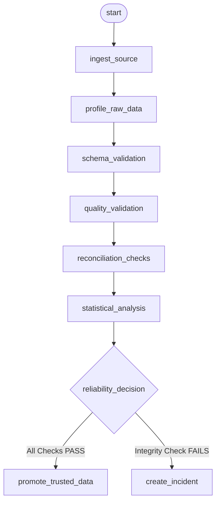

# Apache Airflow Orchestration Architecture & Operations Guide

**E-Way Bill Data Reliability & Reconciliation Pipeline**  
**Phase 8 Documentation**  
**Status:** Implemented & Verified (97/97 tests passing)

---

## 1. DAG Architecture

The Airflow orchestration layer translates the E-Way Bill batch data validation, cross-table reconciliation, and statistical analysis engines into an Airflow-orchestrated batch reliability pipeline.

```
dags/ewaybill_reliability_pipeline.py
```

### Architectural Principles

1. **Separation of Concerns:**  
   The DAG definition acts strictly as a workflow coordinator. All business logic, mathematical computations, data transformations, and database interactions reside entirely within modular Python libraries under `src/` (`src.ingestion`, `src.profiling`, `src.validation`, `src.reconciliation`, `src.statistics`, `src.incidents`, `src.database.repository`). The DAG file imports and invokes these functions without re-implementing logic.
2. **Standard Airflow Operators Only:**  
   The DAG utilizes only standard, production-tested operators:
   - `airflow.operators.empty.EmptyOperator` for pipeline boundary marking.
   - `airflow.operators.python.PythonOperator` for deterministic stage execution.
   - `airflow.operators.python.BranchPythonOperator` for quality gate routing.
3. **Deterministic Run Identification:**  
   Every DAG execution converts Airflow's execution context into a deterministic UUID5 identifier (`airflow://ewaybill/{run_id}`). This UUID is passed down to all pipeline stages and persists across PostgreSQL tables, ensuring full traceability and end-to-end data lineage.
4. **Conditional Promotion Gate:**  
   Data is **never** promoted to the trusted/golden warehouse tables until all schema and data-integrity quality checks pass with zero critical failures.

---

## 2. Task Responsibilities

The pipeline consists of 10 tasks organized in a linear-branching sequence:

| Task ID | Operator | Responsibility | Upstream Dependencies | Downstream Dependencies |
| :--- | :--- | :--- | :--- | :--- |
| `start` | `EmptyOperator` | Pipeline start marker | None | `ingest_source` |
| `ingest_source` | `PythonOperator` | Discovers workbook (`data/Road_EwayBill_2023_24.xlsx`), verifies SHA-256 hash, extracts all 5 worksheets into pandas DataFrames, records execution in `pipeline_runs`, and records metadata in `raw_workbook_metadata` and `raw_sheet_metadata`. | `start` | `profile_raw_data` |
| `profile_raw_data` | `PythonOperator` | Calculates row counts, column counts, missing value statistics, and dimensions for each worksheet. Pushes profiling metrics to XCom. | `ingest_source` | `schema_validation` |
| `schema_validation` | `PythonOperator` | Executes schema checks `SCH-01` through `SCH-12` (verifying required sheets, expected columns, and data types). Identifies any missing or unexpected columns. Pushes failure records to XCom. | `profile_raw_data` | `quality_validation` |
| `quality_validation` | `PythonOperator` | Executes all 64 data quality checks across Completeness (`CMP-01..07`), Uniqueness (`UNQ-01..05`), Domain validity (`DOM-01..09`), Numeric sanity (`NUM-01..20`), Structural integrity (`STR-01..03`), and Source total reconciliations (`REC-V01..08`). Records all check results in `validation_results` table. Pushes failures to XCom. | `schema_validation` | `reconciliation_checks` |
| `reconciliation_checks` | `PythonOperator` | Executes all 6 advisory cross-table reconciliation rules (`REC-DO01` through `REC-DO06`, totaling 102 individual audit checks) across national aggregates, trade flow conservation, and state marginals. Records all audits in `reconciliation_results` table. Pushes blocking failures (if any) to XCom. | `quality_validation` | `statistical_analysis` |
| `statistical_analysis` | `PythonOperator` | Ingests the historical FY 2022–23 baseline workbook, performs canonical state normalization, computes year-over-year deltas, two-sample Kolmogorov-Smirnov tests, Population Stability Index (PSI), and audits `OTHER TERRITORY` cross-year shifts. Records results in `statistical_results` table. | `reconciliation_checks` | `reliability_decision` |
| `reliability_decision` | `BranchPythonOperator` | Quality gate evaluator. Pulls failure records from `schema_validation`, `quality_validation`, and `reconciliation_checks`. If zero blocking data-integrity failures exist, routes to `promote_trusted_data`. If any blocking failure exists, routes to `create_incident`. | `statistical_analysis` | `promote_trusted_data`, `create_incident` |
| `promote_trusted_data` | `PythonOperator` | Normalizes source data into canonical models and bulk-loads rows into the 5 trusted warehouse tables (`trusted_state_movement`, `trusted_chapter_movement`, `trusted_state_chapter_outward`, `trusted_state_chapter_inward`, `trusted_state_chapter_internal`). Marks `pipeline_runs` status as `SUCCESS`. | `reliability_decision` | None |
| `create_incident` | `PythonOperator` | Aggregates all blocking failures, generates a structured incident record in `incidents` table, marks `pipeline_runs` status as `FAILED` with an error message, and raises `AirflowFailException` to mark the DAG execution as failed. | `reliability_decision` | None |

---

## 3. Task Dependency Graph

### Visual Representation (Mermaid)



### Dependency Verification Guarantee

1. **Strict Temporal Sequence:**  
   `start` $\to$ `ingest_source` $\to$ `profile_raw_data` $\to$ `schema_validation` $\to$ `quality_validation` $\to$ `reconciliation_checks` $\to$ `statistical_analysis` $\to$ `reliability_decision`.
2. **Schema Precedes Quality:**  
   Data types and required column existence are verified before business rules or mathematical sums run.
3. **Validation Precedes Reconciliation:**  
   Intra-table integrity is verified before cross-table relationships are computed.
4. **Reconciliation Precedes Statistics:**  
   Structural cross-table equilibrium is evaluated before historical year-over-year drift is calculated.
5. **Decision Follows Statistics:**  
   All validation, reconciliation, and statistical facts are computed and persisted before routing occurs.
6. **Mutually Exclusive Terminal Branches:**  
   Airflow executes either `promote_trusted_data` or `create_incident`, never both.

---

## 4. Retry Policy & Rationale

Airflow tasks are explicitly configured with distinct retry policies based on the nature of the operation:

| Task Class | Tasks | Retries | Retry Delay | Retry Rationale |
| :--- | :--- | :--- | :--- | :--- |
| **Infrastructure & Transient Operations** | `ingest_source`, `promote_trusted_data` | **2** | 30 seconds (exponential backoff) | Network blips, temporary database connection spikes, or file system locks can resolve themselves on retry. |
| **Deterministic Analytical Checks** | `profile_raw_data`, `schema_validation`, `quality_validation`, `reconciliation_checks`, `statistical_analysis`, `reliability_decision` | **0** | None | Analytical validation on immutable input data is completely deterministic. Retrying a failed check against the same dataset will produce the exact same failure, wasting compute resources and delaying operational alerts. |
| **Incident Creation** | `create_incident` | **1** | 10 seconds | Ensures that incident logging to the database completes reliably even if an ephemeral DB contention occurs. |

---

## 5. Failure Semantics

A critical architectural distinction is maintained between **Hard Data Integrity Failures** and **Advisory Findings or Statistical Shifts**.

### 1. Hard Data Integrity Failures (Blocking)
- **Examples:** Missing required worksheet, corrupted header, unrecognized column name, duplicate composite keys (`chapter_code`, `state`), negative movement values, non-numeric strings in numeric cells, or table internal cross-foot discrepancies (`REC-V01..08`).
- **Severity:** `ERROR` or `CRITICAL`.
- **Pipeline Behavior:**  
  - Recorded in `validation_results` with `status='FAIL'`.
  - Pushed to XCom as blocking failures.
  - `reliability_decision` branches to `create_incident`.
  - `promote_trusted_data` is skipped.
  - Incident recorded in `incidents` table with triggering failure details.
  - `pipeline_runs` updated to `status='FAILED'`.
  - DAG execution fails.

### 2. Advisory Cross-Table Reconciliation (Non-Blocking)
- **Examples:** `REC-DO06` Table IV vs Table II / Table III for `OTHER TERRITORY` (where inward trade contains ₹3,030.56 crore not present in outward trade or interstate movement).
- **Status:** `UNRESOLVED` (Severity: `WARNING`).
- **Pipeline Behavior:**  
  - Recorded as a non-blocking unresolved cross-table discrepancy under the current governance rules. Statistical difference does not by itself establish data corruption, pipeline failure, or an economic cause.
  - Logged in `reconciliation_results` for audit and inspection.
  - **Does NOT** block promotion to trusted tables, preserving the source data as published without unverified adjustments.

### 3. Year-over-Year Statistical Distribution Differences (Non-Blocking)
- **Examples:** Two-sample Kolmogorov-Smirnov test returning $p < 0.05$ (`STATISTICALLY_DIFFERENT`), or Population Stability Index (PSI) $> 0.25$.
- **Status:** `STATISTICALLY_DIFFERENT` (Severity: `INFO` / `WARNING`).
- **Pipeline Behavior:**  
  - Recorded in `statistical_results`.
  - **Does NOT** fail the pipeline or halt data promotion.
  - **Rationale:** A statistical difference between annual snapshots indicates a distributional change between the two reference periods under the tested assumptions. Statistical difference does not by itself establish data corruption, pipeline failure, or an economic cause. It is retained as an advisory analytical finding rather than a blocking operational failure.

---

## 6. Run-ID Handling & Lineage Preservation

The pipeline enforces deterministic, traceable run identification across Airflow and PostgreSQL:

```python
def compute_deterministic_run_id(context: dict) -> str:
    raw_id = context.get("run_id") or context.get("dag_run").run_id
    return str(uuid.uuid5(uuid.NAMESPACE_URL, f"airflow://ewaybill/{raw_id}"))
```

### Lineage Guarantees

1. **PostgreSQL UUID Compatibility:**  
   Airflow run IDs (e.g. `manual__2026-09-27T12:00:00+00:00`) are converted into RFC-4122 compliant UUIDs, matching PostgreSQL's native `UUID` type.
2. **Global Join Key:**  
   The same `run_id` is passed through all tasks and binds all database entities:
   - `pipeline_runs.run_id` (Parent record)
   - `raw_workbook_metadata.run_id`
   - `raw_sheet_metadata.run_id`
   - `validation_results.run_id`
   - `reconciliation_results.run_id`
   - `statistical_results.run_id`
   - `trusted_state_movement.run_id`
   - `trusted_chapter_movement.run_id`
   - `trusted_state_chapter_outward.run_id`
   - `trusted_state_chapter_inward.run_id`
   - `trusted_state_chapter_internal.run_id`
   - `incidents.run_id`
3. **Complete Forensic Traceability:**  
   Given any row in `trusted_state_chapter_outward`, an engineer can query `validation_results`, `reconciliation_results`, and `pipeline_runs` for that identical `run_id` to inspect the exact audit certificates generated during that specific ingestion run.

---

## 7. Idempotency Approach

Re-running the pipeline for an identical execution date or manual trigger must never inflate row counts, create duplicate records, or corrupt warehouse state.

### Idempotency Mechanics in `src/database/repository.py`

Every loading function performs an atomic, run-scoped pre-deletion before inserting new records:

```sql
-- Example idempotent pattern across all persistence methods:
DELETE FROM trusted_state_movement WHERE run_id = %(run_id)s;
DELETE FROM validation_results WHERE run_id = %(run_id)s;
DELETE FROM reconciliation_results WHERE run_id = %(run_id)s;
DELETE FROM statistical_results WHERE run_id = %(run_id)s;
DELETE FROM incidents WHERE run_id = %(run_id)s;
```

- **Re-runs:** Re-running the DAG for an existing `run_id` replaces the previous run's results cleanly within a single transaction.
- **Unique Constraints:** The trusted warehouse tables maintain compound unique constraints:
  - `trusted_state_movement`: `UNIQUE (run_id, state)`
  - `trusted_chapter_movement`: `UNIQUE (run_id, chapter_code)`
  - `trusted_state_chapter_*`: `UNIQUE (run_id, chapter_code, state)`
- **Foreign Key Cascading:** `pipeline_runs` uses `ON DELETE CASCADE`, allowing safe, atomic purge of any test or corrupted run.

---

## 8. PostgreSQL Integration

The warehouse schema resides in `sql/schema.sql`.

### Relational Entity-Relationship Flow

```
pipeline_runs (PK: run_id)
 ├── raw_workbook_metadata
 ├── raw_sheet_metadata
 ├── validation_results
 ├── reconciliation_results
 ├── statistical_results
 ├── trusted_state_movement
 ├── trusted_chapter_movement
 ├── trusted_state_chapter_outward
 ├── trusted_state_chapter_inward
 ├── trusted_state_chapter_internal
 └── incidents
```

All connection parameters are dynamically resolved from environment variables via `src.database.connection.get_db_connection()`:
- `POSTGRES_HOST` (default: `localhost`)
- `POSTGRES_PORT` (default: `5433` for local dev; `5432` inside Docker)
- `POSTGRES_DB` (default: `ewaybill_dw`)
- `POSTGRES_USER` (default: `postgres`)
- `POSTGRES_PASSWORD` (default: `postgres`)

---

## 9. Local Execution Instructions

### A. Python Environment (Direct Test & Verification)

To test the DAG and all underlying pipeline engines locally:

```bash
# Activate virtual environment
.\.venv\Scripts\Activate.ps1

# Run DAG unit tests
pytest -v tests/test_airflow_dag.py

# Run full project test suite (all 97 tests)
pytest -v
```

### B. Docker Compose (Full Airflow Webserver & Scheduler)

The project includes a minimal `docker-compose.yaml` utilizing official Apache Airflow 2.10.5 images and PostgreSQL 17.

```bash
# 1. Initialize Airflow metadata database and create default admin user
docker compose up airflow-init

# 2. Start PostgreSQL, Airflow Webserver, and Airflow Scheduler in background
docker compose up -d

# 3. Verify container health
docker compose ps

# 4. Trigger the pipeline DAG
docker compose exec airflow-webserver airflow dags trigger ewaybill_reliability_pipeline

# 5. Tail scheduler and task execution logs
docker compose logs -f airflow-scheduler

# 6. Access the Airflow UI
# URL: http://localhost:8080
# Username: admin
# Password: admin
```

To shut down the local cluster:
```bash
docker compose down -v
```

---

## 10. Limitations of Current Orchestration Design

While the Phase 8 orchestration provides robust reliability guarantees, the following limitations exist by design and represent candidates for future scaling:

1. **LocalExecutor / Single-Node Bound:**  
   The current configuration uses `LocalExecutor`. For high-throughput horizontal scaling across distributed clusters, Celery or Kubernetes executors would be required.
2. **Batch Polling vs. Event-Driven Sensors:**  
   The pipeline executes on a manual trigger or scheduled cron. It does not currently implement a file-watch sensor (`FileSensor` or S3/GCS object arrival sensor) to automatically trigger upon raw file upload.
3. **In-Memory Spreadsheet Parsing:**  
   The ingestion layer loads Excel sheets into pandas DataFrames in memory. For multi-gigabyte workbooks, streaming chunk ingestion or parquet conversion would be necessary to prevent memory pressure.
4. **Advisory Reconciliations Require Human Review:**  
   While `REC-DO06` `OTHER TERRITORY` is correctly flagged as `UNRESOLVED` without halting the pipeline, resolution of the discrepancy remains an external governance duty.
5. **No External Notification Dispatch:**  
   Incidents are persisted to the database `incidents` table, but external alert dispatchers (Slack, PagerDuty, Email) are deliberately deferred to future phases.
