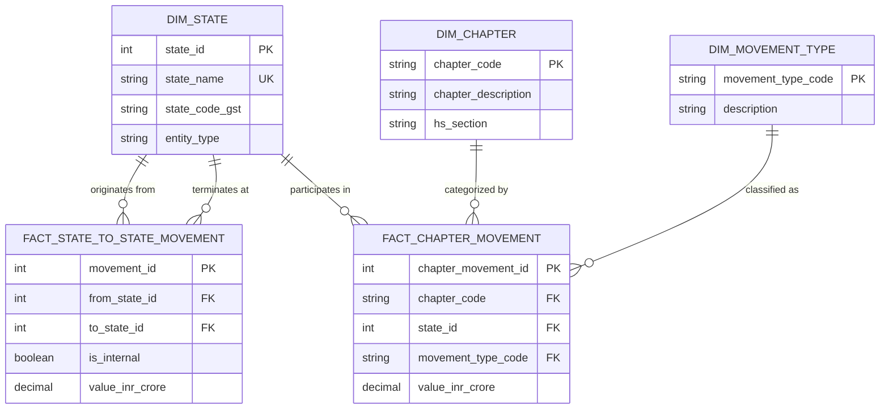

# Source Profiling Report: Road E-Way Bill 2023–24

**File Target:** `data/Road_EwayBill_2023_24.xlsx`  
**Issuing Authority:** Directorate General of Commercial Intelligence and Statistics (DGCI&S), Ministry of Commerce and Industry, Government of India  
**System Source:** GST E-Way Bill System (National Informatics Centre / GSTN)  
**Reporting Period:** Financial Year 2023–24 (April 1, 2023 – March 31, 2024)  
**Mode of Transport:** Road Freight Only  
**Profiling Date:** September 2026  
**Profiling Tool:** Automated Python OpenPyXL/Pandas Profiler (`scripts/profile_workbook.py`)

---

## 1. Executive Summary

This source profiling report provides a comprehensive, programmatic inspection of the official Government of India / DGCI&S Road E-Way Bill dataset for FY 2023–24. The source dataset captures domestic inter-state and intra-state goods movements transported by road under the Goods and Services Tax (GST) E-Way Bill regime.

### Key Dataset Telemetry

| Metric | Profile Value | Technical Significance |
| :--- | :--- | :--- |
| **Total Worksheets** | 5 | All sheets contain tabular matrices of road freight data. |
| **File Format** | Microsoft Excel XML (.xlsx) | Compressed OpenXML format, uncompressed size ~169 KB. |
| **Formula Count** | **0** | **100% static values.** No dynamic Excel formulas (`=SUM(...)`) exist anywhere. All sums are hardcoded string/float literals generated upstream by batch ETL. |
| **Geographic Entities** | 33 | 28 States + 4 Union Territories + 1 Special Jurisdiction (`OTHER TERRITORY`). |
| **HS Commodity Chapters** | 90 | Chapters 10 through 99. Chapters 01–09 are completely omitted. |
| **Monetary Unit** | INR Crore ($10^7$ INR) | Stated explicitly in Row 1 title headers across all sheets. |
| **National Total Movement Value** | **20,319,786.98 Crore** | Reconciled across Sheet 1, Sheet 2, and combined Sheet 3+5 / Sheet 4+5 (approx. ₹20.32 Lakh Crore / ~$2.45 Trillion USD). |
| **National Outward Movement** | **10,429,324.40 Crore** | Sum of Sheet 3 column totals across all 33 states. |
| **National Inward Movement** | **10,429,324.40 Crore** | Sum of Sheet 4 column totals across all 33 states (Exact match with Outward: $\Delta = 0.0$). |
| **National Internal Movement** | **9,890,462.58 Crore** | Sum of Sheet 5 column totals across all 33 states. |

---

## 2. Worksheet Catalog & Dimensional Overview

The workbook contains five distinct worksheets. In every worksheet, **Column A (Column index 1) is completely empty**. Tabular content begins strictly at Column B (Column index 2).

### Summary Dimension Matrix

| # | Worksheet Name | Declared Excel Dimensions | Actual Content Bounding Box | Data Rows (Excl. Headers/Totals) | Value Columns | Formula Count | Merged Cell Ranges |
| :-: | :--- | :---: | :---: | :---: | :---: | :-: | :-: |
| 1 | `Tab I_Stat_to_Stat_Revised_Road` | `A1:AJ40` ($40 \times 36$) | Rows `1:36`, Cols `B:AI` ($36 \times 34$) | 33 | 33 | 0 | 34 |
| 2 | `Tab II_Chap_Revised_Road` | `A1:E94` ($94 \times 5$) | Rows `1:93`, Cols `B:D` ($93 \times 3$) | 90 | 1 | 0 | 2 |
| 3 | `Tab III_Outward_Revised_Road` | `A1:AK94` ($94 \times 37$) | Rows `1:93`, Cols `B:AJ` ($93 \times 35$) | 90 | 33 | 0 | 2 |
| 4 | `Tab IV_Inward_Revised_Road` | `A1:AL95` ($95 \times 38$) | Rows `1:93`, Cols `B:AK` ($93 \times 36$) | 90 | 34 (33 states + TOTAL) | 0 | 1 |
| 5 | `Tab V_Internal_Revised_Road` | `A1:AL94` ($94 \times 38$) | Rows `1:93`, Cols `B:AK` ($93 \times 36$) | 90 | 34 (33 states + TOTAL) | 0 | 1 |

---

## 3. Worksheet-by-Worksheet Deep Profile

---

### Sheet 1: `Tab I_Stat_to_Stat_Revised_Road`

#### 1. Description & Purpose
Represents an origin-destination square matrix ($33 \times 33$) recording the total monetary value of goods moved by road between every pair of Indian States/UTs during FY 2023–24. The matrix encapsulates both inter-state movements (off-diagonal cells) and intra-state movements (diagonal cells).

#### 2. Layout & Bounding Coordinates
- **Declared Range:** `A1:AJ40` (Max Row: 40, Max Column: 36)
- **Active Data Bounding Box:** Row 1 to Row 36; Column B (Col 2) to Column AI (Col 35).
- **Empty Rows:** Rows 37, 38, 39, and 40 contain no cell values or formatting.
- **Empty Columns:** Column A (Col 1) and Column AJ (Col 36) are completely empty.

#### 3. Headers, Merged Cells & Title Rows
- **Title Block:** Row 1, Cell `B1` containing text:
  `"Table I : State wise Movement of Goods by Road during 2023 - 24 (Value in INR Crore)"`.
  Merged across `B1:N1`.
- **Header Structure:** 2-row multi-level hierarchical header in Rows 2 and 3:
  - Cell `B2`: `"From State ---->>"`
  - Cell `B3`: `"To State ---->>"`
  - Columns C through AI (Cols 3–35) contain 33 merged vertical ranges (`C2:C3`, `D2:D3`, ... `AI2:AI3`), where each column represents a state name.
- **Total Merged Ranges:** 34 (`B1:N1` + 33 column headers).

#### 4. Tabular Data Boundaries
- **Header Rows:** Rows 2 and 3.
- **Data Begins:** Row 4 (`ANDHRA PRADESH`).
- **Data Ends:** Row 36 (`WEST BENGAL`).
- **Row Identifier Column:** Column B (Col 2), listing 33 destination states in alphabetical order.
- **Value Columns:** Column C to Column AI (Cols 3–35), corresponding to 33 origin states.
- **Total Row / Total Column:** **None.** The sheet does not contain a hardcoded summary row or summary column.

#### 5. Data Types & Storage
- Row labels: `str` (State names).
- Cell values: 64-bit `float` representing monetary amounts in INR Crore.
- Empty cells: Stored as `None` (openpyxl `NoneType`).

#### 6. Missing Values & Sparsity
- Total matrix cells: $33 \times 33 = 1,089$ cells.
- Populated numeric cells: 1,084.
- **Missing / Empty Cells (5 occurrences):**
  1. Row 11 (`GOA`), Col 20 (`MANIPUR`)
  2. Row 11 (`GOA`), Col 22 (`MIZORAM`)
  3. Row 27 (`PUDUCHERRY`), Col 4 (`ARUNACHAL PRADESH`)
  4. Row 27 (`PUDUCHERRY`), Col 20 (`MANIPUR`)
  5. Row 27 (`PUDUCHERRY`), Col 22 (`MIZORAM`)
- **Semantic Interpretation:** These 5 cells reflect routes where zero commercial road freight E-Way bills were generated during FY 2023–24. They represent true economic zeros ($₹0.00$).

#### 7. Structural & Mathematical Observations
- **Diagonal Values:** The diagonal cells ($[i, i]$ where From State == To State) record intra-state (internal) goods movement.
- **Matrix Sum:** The sum of all 1,089 cells (treating `None` as 0) equals exactly **20,319,786.98011017 INR Crore**, matching Sheet 2 national total.
- **Column Marginal Sums:** Column sums ($[*, j]$) equal $\text{Outward Movement}_j + \text{Internal Movement}_j$ for state $j$.
- **Row Marginal Sums:** Row sums ($[i, *]$) equal $\text{Inward Movement}_i + \text{Internal Movement}_i$ for state $i$.

---

### Sheet 2: `Tab II_Chap_Revised_Road`

#### 1. Description & Purpose
Represents a flat master table of 2-digit Harmonized System (HS) Chapters and the total national road freight movement value recorded under each chapter for FY 2023–24.

#### 2. Layout & Bounding Coordinates
- **Declared Range:** `A1:E94` (Max Row: 94, Max Column: 5)
- **Active Data Bounding Box:** Row 1 to Row 93; Column B (Col 2) to Column D (Col 4).
- **Empty Rows:** Row 94 is completely blank.
- **Empty Columns:** Column A (Col 1) and Column E (Col 5) are completely empty.

#### 3. Headers, Merged Cells & Title Rows
- **Title Block:** Row 1, Cell `B1`:
  `"Table II:Chapter wise Movement of Goods by Road during 2023 - 24 (Value in INR Crore)"`.
  Merged across `B1:E1`.
- **Header Row:** Row 2:
  - `B2`: `"CHAPTER CODE"`
  - `C2`: `"CHAPTER DESCRIPTION"`
  - `D2`: `"VALUE (in INR Crore)"`
- **Total Row:** Row 93:
  - `B93:C93` merged with text: `"TOTAL VALUE (in INR Crore)---->>"`
  - `D93`: Numeric value `20319786.98011017`
- **Total Merged Ranges:** 2 (`B1:E1`, `B93:C93`).

#### 4. Tabular Data Boundaries
- **Header Row:** Row 2.
- **Data Begins:** Row 3 (`Chapter 10`, `"CEREALS"`, value: `150734.4683559228`).
- **Data Ends:** Row 92 (`Chapter 99`, `"MISCELLANEOUS GOODS"`, value: `20568.751657250985`).
- **Number of Chapters:** 90 records.

#### 5. Data Types & Storage
- `CHAPTER CODE`: `str` (two-digit character strings: `'10'` through `'99'`).
- `CHAPTER DESCRIPTION`: `str` (uppercase commodity narrative).
- `VALUE (in INR Crore)`: 64-bit `float`.

#### 6. Missing Values & Sparsity
- **Zero missing values.** All 90 rows have valid codes, descriptions, and numeric values.

#### 7. Structural & Mathematical Observations
- Sum of data rows 3 through 92: **20,319,786.98011017 INR Crore**.
- Difference against Row 93 reported total: **0.000000000000** (Exact precision match).
- HS Chapters 01 to 09 are absent from the table.

---

### Sheet 3: `Tab III_Outward_Revised_Road`

#### 1. Description & Purpose
Represents a matrix of HS Chapters (rows) by Origin State (columns), detailing the total value of outward goods moved by road from each state to all other states (inter-state outward dispatch) during FY 2023–24.

#### 2. Layout & Bounding Coordinates
- **Declared Range:** `A1:AK94` (Max Row: 94, Max Column: 37)
- **Active Data Bounding Box:** Row 1 to Row 93; Column B (Col 2) to Column AJ (Col 36).
- **Empty Rows:** Row 94 is completely blank.
- **Empty Columns:** Column A (Col 1) and Column AK (Col 37) are completely empty.

#### 3. Headers, Merged Cells & Title Rows
- **Title Block:** Row 1, Cell `B1`:
  `"Table III:Chapter wise Outward Movement of Goods by Road during 2023 - 24 (Value in INR Crore)"`.
  Merged across `B1:M1`.
- **Header Row:** Row 2:
  - `B2`: `"CHAPTER CODE"`
  - `C2`: `"CHAPTER DESCRIPTION"`
  - `D2:AJ2`: 33 state column headers (from `ANDHRA PRADESH` in Col D to `WEST BENGAL` in Col AJ).
- **Total Row:** Row 93:
  - `B93:C93` merged with text: `"OUTWARD VALUE (in INR Crore) ----->>"`
  - `D93:AJ93`: 33 hardcoded state outward total values.
- **Total Merged Ranges:** 2 (`B1:M1`, `B93:C93`).

#### 4. Tabular Data Boundaries
- **Data Begins:** Row 3 (`Chapter 10`).
- **Data Ends:** Row 92 (`Chapter 99`).
- **Summary Row:** Row 93 (`OUTWARD VALUE`).
- **Summary Column:** **None.** Unlike Sheets 4 and 5, Sheet 3 does **not** contain a `TOTAL` column on the right.

#### 5. Data Types & Storage
- `CHAPTER CODE`, `CHAPTER DESCRIPTION`: `str`.
- Value cells: Primarily `float`, with occasional `int` (e.g. `0`), and `None` for empty cells.

#### 6. Missing Values & Sparsity
- Total matrix cells: $90 \text{ chapters} \times 33 \text{ states} = 2,970$ cells.
- Populated numeric cells: 2,862.
- **Missing / Empty Cells:** 108 cells ($3.64\%$).
- **Top affected chapters:**
  - Chapter 77 ("RESERVED FOR POSSIBLE FUTURE USE"): 23 states empty.
  - Chapter 43 ("FURSKINS AND ARTIFICIAL FUR"): 10 states empty.
  - Chapter 45 ("CORK"): 6 states empty.
  - Chapter 67 ("PREPARED FEATHERS"): 6 states empty.
- **Top affected states:**
  - MIZORAM: 22 chapters empty.
  - SIKKIM: 17 chapters empty.
  - MANIPUR: 14 chapters empty.
  - TRIPURA: 12 chapters empty.
- **Interpretation:** Reflects lack of dispatch for specialized commodities from small or northeastern states. Treating `None` as 0 yields exact mathematical balance.

#### 7. Structural & Mathematical Observations
- Sum of data cells across all chapters and states: **10,429,324.404046647 INR Crore**.
- Column sums match Row 93 reported state totals with maximum absolute deviation $\le 2.33 \times 10^{-10}$ (floating-point epsilon).

---

### Sheet 4: `Tab IV_Inward_Revised_Road`

#### 1. Description & Purpose
Represents a matrix of HS Chapters (rows) by Destination State (columns), detailing the total value of goods received by road from all other states (inter-state inward arrivals) during FY 2023–24.

#### 2. Layout & Bounding Coordinates
- **Declared Range:** `A1:AL95` (Max Row: 95, Max Column: 38)
- **Active Data Bounding Box:** Row 1 to Row 93; Column B (Col 2) to Column AK (Col 37).
- **Empty Rows:** Rows 94 and 95 are completely blank.
- **Empty Columns:** Column A (Col 1) and Column AL (Col 38) are completely empty.

#### 3. Headers, Merged Cells & Title Rows
- **Title Block:** Row 1, Cell `B1`:
  `"Table IV:Chapter wise Inward Movement of Goods by Road during 2023 - 24 (Value in INR Crore)"`.
  **Not merged** (plain text in `B1`).
- **Header Row:** Row 2:
  - `B2`: `"CHAPTER CODE"`
  - `C2`: `"CHAPTER DESCRIPTION"`
  - `D2:AJ2`: 33 state column headers.
  - `AK2`: `"TOTAL"` (row-wise total across states for that chapter).
- **Total Row:** Row 93:
  - `B93:C93` merged with text: `"INWARD VALUE (in INR Crore) ----->>"`
  - `D93:AJ93`: 33 state inward totals.
  - `AK93`: Grand total of all inward movements (`10429324.40404665`).
- **Total Merged Ranges:** 1 (`B93:C93`).

#### 4. Tabular Data Boundaries
- **Data Begins:** Row 3 (`Chapter 10`).
- **Data Ends:** Row 92 (`Chapter 99`).
- **Summary Row:** Row 93 (`INWARD VALUE`).
- **Summary Column:** Column AK (Col 37), labeled `"TOTAL"`.

#### 5. Data Types & Storage
- `CHAPTER CODE`, `CHAPTER DESCRIPTION`: `str`.
- Value cells: `float` and `None`.

#### 6. Missing Values & Sparsity
- Total matrix cells (excl. TOTAL column): 2,970 cells.
- **Missing / Empty Cells:** 27 cells ($0.91\%$).
- Concentrated primarily in Chapter 77 (18 states empty) and Chapter 43 (4 states empty). Inward arrivals are more widely distributed than outward dispatches.

#### 7. Structural & Mathematical Observations
- Sum of all 33 state column totals: **10,429,324.404046647 INR Crore**.
- Grand Total in Cell `AK93`: **10,429,324.40404665 INR Crore**.
- Cross-foot check: For every chapter $i \in [3, 92]$, $\sum_{j=1}^{33} \text{State}_{i,j} = \text{TOTAL}_i$ with maximum difference $\le 1.8 \times 10^{-12}$.
- National Inward Total matches National Outward Total (Sheet 3) to 0.000000 INR Crore.

---

### Sheet 5: `Tab V_Internal_Revised_Road`

#### 1. Description & Purpose
Represents a matrix of HS Chapters (rows) by State (columns), detailing the value of goods generated and delivered entirely within the same State/UT boundary (intra-state or "internal" movement) by road during FY 2023–24.

#### 2. Layout & Bounding Coordinates
- **Declared Range:** `A1:AL94` (Max Row: 94, Max Column: 38)
- **Active Data Bounding Box:** Row 1 to Row 93; Column B (Col 2) to Column AK (Col 37).
- **Empty Rows:** Row 94 is completely blank.
- **Empty Columns:** Column A (Col 1) and Column AL (Col 38) are completely empty.

#### 3. Headers, Merged Cells & Title Rows
- **Title Block:** Row 1, Cell `B1`:
  `"Table V:Chapter wise Internal Movement of Goods by Road during 2023 - 24 (Value in INR Crore)"`.
  **Not merged** (plain text in `B1`).
- **Header Row:** Row 2:
  - `B2`: `"CHAPTER CODE"`
  - `C2`: `"CHAPTER DESCRIPTION"`
  - `D2:AJ2`: 33 state column headers.
  - `AK2`: `"TOTAL"` (row-wise total across states for that chapter).
- **Total Row:** Row 93:
  - `B93:C93` merged with text: `"INTERNAL VALUE (in INR Crore) ----->>"`
  - `D93:AJ93`: 33 state internal totals.
  - `AK93`: Grand total of all internal movements (`9890462.576063517`).
- **Total Merged Ranges:** 1 (`B93:C93`).

#### 4. Tabular Data Boundaries
- **Data Begins:** Row 3 (`Chapter 10`).
- **Data Ends:** Row 92 (`Chapter 99`).
- **Summary Row:** Row 93 (`INTERNAL VALUE`).
- **Summary Column:** Column AK (Col 37), labeled `"TOTAL"`.

#### 5. Data Types & Storage
- `CHAPTER CODE`, `CHAPTER DESCRIPTION`: `str`.
- Value cells: `float`, `int`, and `None`.

#### 6. Missing Values & Sparsity
- Total matrix cells (excl. TOTAL column): 2,970 cells.
- **Missing / Empty Cells:** 164 cells ($5.52\%$).
- High incidence in northeastern states: Mizoram (40 chapters null), Nagaland (25), Manipur (23), Sikkim (19), Arunachal Pradesh (15).
- Internal production/manufacturing in smaller states does not occur in all 90 chapters.

#### 7. Structural & Mathematical Observations
- Sum of all 33 state internal totals: **9,890,462.576063516 INR Crore**.
- Grand Total in Cell `AK93`: **9,890,462.576063517 INR Crore**.
- Sum of Sheet 3 (Outward) + Sheet 5 (Internal) = **20,319,786.98011016 INR Crore**, which matches Sheet 2 total (20,319,786.98011017) within floating-point epsilon.

---

## 4. Cross-Sheet Consistency & Discrepancy Analysis

### 4.1 Geographic Entity Master List (33 States & UTs)
All sheets share an identical sequence of 33 geographic entities. There are no spelling variations or column ordering differences between sheets.

```
 1. ANDHRA PRADESH       12. JAMMU & KASHMIR (UT) 23. OTHER TERRITORY (Special)
 2. ARUNACHAL PRADESH    13. JHARKHAND            24. PUDUCHERRY (UT)
 3. ASSAM                14. KARNATAKA            25. PUNJAB
 4. BIHAR                15. KERALA               26. RAJASTHAN
 5. CHANDIGARH (UT)      16. MADHYA PRADESH       27. SIKKIM
 6. CHATTISGARH (State)* 17. MAHARASHTRA          28. TAMIL NADU
 7. DELHI (UT)           18. MANIPUR              29. TELANGANA
 8. GOA                  19. MEGHALAYA            30. TRIPURA
 9. GUJARAT              20. MIZORAM              31. UTTAR PRADESH
10. HARYANA              21. NAGALAND             32. UTTARAKHAND
11. HIMACHAL PRADESH     22. ODISHA               33. WEST BENGAL
```

#### Administrative Inconsistencies & Observations:
1. **Non-Standard Spelling:** `CHATTISGARH` is spelled with a single "H" instead of the official constitutionally recognized name `CHHATTISGARH`.
2. **Missing Union Territories (4 missing):**
   - `ANDAMAN & NICOBAR ISLANDS`: Island territory with no road bridge connectivity to mainland India; road E-Way bills are not applicable.
   - `LAKSHADWEEP`: Island territory with no road connectivity.
   - `LADAKH`: Not separately listed. Movement likely aggregated under `JAMMU & KASHMIR` or `OTHER TERRITORY`.
   - `DADRA & NAGAR HAVELI AND DAMAN & DIU`: Not listed. Likely aggregated with neighboring `GUJARAT` / `MAHARASHTRA` or classified under `OTHER TERRITORY`.
3. **Presence of `OTHER TERRITORY`:** Under Section 2(81) of the CGST Act 2017, "Other Territory" represents offshore marine areas, the continental shelf, Exclusive Economic Zones (EEZ) beyond 12 nautical miles, and designated offshore extraction sites (e.g. Bombay High oil rigs).

---

### 4.2 Commodity Chapter Master List (90 HS Chapters)
All four chapter-based tables (Sheets 2, 3, 4, 5) contain the identical set of 90 HS Chapter codes (`'10'` through `'99'`) and matching chapter descriptions.

#### Commodity Observations & Anomalies:
1. **Omission of Chapters 01 to 09:**
   - Under Rule 138(14) of the CGST Rules, 2017 (read with Notification No. 27/2017-Central Tax), raw and unprocessed agricultural goods, live animals, fresh meat, fish, milk, fresh fruits, vegetables, and tea/coffee beans are **statutorily exempt** from the requirement of generating an E-Way Bill. Hence, road movement for these goods is not captured in this dataset.
2. **Presence of Chapter 77:**
   - Chapter 77 is officially `"RESERVED FOR POSSIBLE FUTURE USE"` by the World Customs Organization. The dataset records minimal activity in Chapter 77 (₹0.74 Crore internal movement in Sheet 5, ₹0 in others), likely resulting from clerical tax-invoice misclassification by taxpayers.
3. **Lexical Typos in Official Descriptions:**
   - Chapter 16: `MOLLUSES` instead of `MOLLUSCS`.
   - Chapter 19: `MIILK` instead of `MILK`; `PASTRY COOK' PRODUCTS` instead of `PASTRYCOOKS' PRODUCTS`.
   - Chapter 36: `CERTAN COMBUSTIBLES PREPARATIONS` instead of `CERTAIN COMBUSTIBLE PREPARATIONS`.
   - Chapter 41: `OTHER THEN FURSKINS` instead of `OTHER THAN FURSKINS`.
   - Chapter 77: `POSSIBE` instead of `POSSIBLE`.
   - Chapter 90: `MEASUREING` instead of `MEASURING`.

---

### 4.3 Structural Inconsistencies Between Sheets

1. **Missing `TOTAL` Column in Sheet 3:**
   - Sheet 4 (Inward) and Sheet 5 (Internal) provide a row-wise summary column `TOTAL` in Column AK (Col 37).
   - Sheet 3 (Outward) **omits** the `TOTAL` column entirely; Column AJ (`WEST BENGAL`) is immediately followed by empty Column AK.
2. **Uneven Worksheet Padding / Trailing Blank Rows:**
   - Sheet 1 contains 4 trailing empty rows (Rows 37–40).
   - Sheet 4 contains 2 trailing empty rows (Rows 94–95).
   - Sheets 2, 3, and 5 contain 1 trailing empty row (Row 94).
3. **Title Cell Merging Style:**
   - Sheets 1, 2, and 3 merge the title string across multiple columns (`B1:N1`, `B1:E1`, `B1:M1`).
   - Sheets 4 and 5 do not merge cells in Row 1 (plain text in `B1`).
4. **Header Row Depth:**
   - Sheet 1 uses a 2-row multi-tier header (Rows 2–3) with vertical cell merges across 33 columns.
   - Sheets 2, 3, 4, and 5 use a single header row (Row 2).

---

## 5. The "OTHER TERRITORY" Allocation Discrepancy (Deep Dive)

A critical numerical finding emerged when comparing the diagonal of Sheet 1 ($S_1[i, i]$) against the internal state totals reported in Sheet 5 ($S_5[\text{TOTAL}, i]$):

### Diagonal vs. Internal Movement Comparison

- For **32 out of 33 States/UTs**, the diagonal element of Sheet 1 is an **exact match** to the Sheet 5 internal total:
  $$\Delta = |S_1[i, i] - S_5[\text{TOTAL}, i]| = 0.000000000000 \quad (\forall i \neq \text{OTHER TERRITORY})$$
- For **`OTHER TERRITORY`**, there is a large divergence of **₹76,614.93 Crore**:
  - Sheet 1 Diagonal (`OTHER TERRITORY -> OTHER TERRITORY`): **₹258,324.42 Crore**
  - Sheet 5 Internal Row 93 (`OTHER TERRITORY` Internal Total): **₹181,709.49 Crore**
  - **Discrepancy:** $+₹76,614.93353894832 \text{ Crore}$

### The Marginal Conservation Property
Remarkably, despite this internal reclassification, the marginal column sums and row sums of Sheet 1 **fully conserve** the overall totals across all 33 entities:

1. **Column Sum Conservation:**
   $$\sum_{r=4}^{36} S_1[r, \text{OTHER TERRITORY}] = 1,942,706.14 \text{ Crore}$$
   $$\text{Outward Total (Sheet 3)} + \text{Internal Total (Sheet 5)} = 1,760,996.66 + 181,709.49 = 1,942,706.14 \text{ Crore}$$
   $$\Delta = 0.000000000 \text{ Crore}$$

2. **Row Sum Conservation:**
   $$\sum_{c=3}^{35} S_1[\text{OTHER TERRITORY}, c] = 1,624,743.52 \text{ Crore}$$
   $$\text{Inward Total (Sheet 4)} + \text{Internal Total (Sheet 5)} = 1,443,034.03 + 181,709.49 = 1,624,743.52 \text{ Crore}$$
   $$\Delta = 0.000000000 \text{ Crore}$$

### Data Pipeline Interpretation
This indicates that ₹76,614.93 Crore was classified as **intra-territorial** (diagonal) in the State-to-State origin-destination pipeline (Sheet 1), but was partitioned into **inter-state outward/inward** dispatches in the Chapter-wise pipelines (Sheets 3 and 4). This behavior reflects differing boundary definitions for offshore maritime transactions during source aggregation.

---

## 6. Relational Normalization Feasibility

The five worksheets can be normalized into a unified Third Normal Form (3NF) relational star/snowflake schema.



### Proposed Relational Tables & Keys

#### 1. Dimension: `dim_state`
- `state_id` (INT, Primary Key, surrogate 1..33)
- `state_name` (VARCHAR, Unique, normalized uppercase e.g. `'CHHATTISGARH'`)
- `raw_state_name` (VARCHAR, original name e.g. `'CHATTISGARH'`)
- `entity_type` (VARCHAR, `'STATE'`, `'UNION_TERRITORY'`, `'SPECIAL_TERRITORY'`)

#### 2. Dimension: `dim_chapter`
- `chapter_code` (CHAR(2), Primary Key, `'10'` through `'99'`)
- `chapter_description` (VARCHAR, cleaned commodity narrative)
- `is_exempt` (BOOLEAN, default FALSE)

#### 3. Dimension: `dim_movement_type`
- `movement_type_code` (CHAR(8), Primary Key: `'OUTWARD'`, `'INWARD'`, `'INTERNAL'`)
- `description` (VARCHAR)

#### 4. Fact Table: `fact_state_to_state_movement` (from Sheet 1)
- `movement_id` (BIGINT, Primary Key)
- `from_state_id` (INT, Foreign Key -> `dim_state.state_id`)
- `to_state_id` (INT, Foreign Key -> `dim_state.state_id`)
- `is_internal` (BOOLEAN, generated as `from_state_id == to_state_id`)
- `value_inr_crore` (NUMERIC(18, 6), non-null, default 0.0)
- **Natural Composite Key:** `(from_state_id, to_state_id)`
- **Row Count:** $33 \times 33 = 1,089$ rows.

#### 5. Fact Table: `fact_chapter_movement` (melted from Sheets 3, 4, 5)
- `chapter_movement_id` (BIGINT, Primary Key)
- `chapter_code` (CHAR(2), Foreign Key -> `dim_chapter.chapter_code`)
- `state_id` (INT, Foreign Key -> `dim_state.state_id`)
- `movement_type_code` (CHAR(8), Foreign Key -> `dim_movement_type.movement_type_code`)
- `value_inr_crore` (NUMERIC(18, 6), non-null, default 0.0)
- **Natural Composite Key:** `(chapter_code, state_id, movement_type_code)`
- **Row Count:** $90 \text{ chapters} \times 33 \text{ states} \times 3 \text{ types} = 8,910$ rows.

---

## 7. Explicit Reconciliation Hypotheses

> [!IMPORTANT]
> The following hypotheses represent empirical and mathematical deductions derived during source profiling. In accordance with strict data reliability governance, each statement is formally tagged as **HYPOTHESIS — REQUIRES METHODOLOGY VERIFICATION** and must be validated against official DGCI&S compilation methodology before building production reconciliation pipelines.

---

### [HYPOTHESIS — REQUIRES METHODOLOGY VERIFICATION] Hypothesis 1: Sheet 1 Column Headers Represent Origin State ("From State") and Row Headers Represent Destination State ("To State")
- **Statement:** In Sheet 1 (`Tab I_Stat_to_Stat_Revised_Road`), each column corresponds to the dispatching entity (Origin / "From State"), while each row corresponds to the receiving entity (Destination / "To State").
- **Evidence:**
  - Off-diagonal column sums ($\sum_{r \neq c} S_1[r, c]$) align with Sheet 3 (`Outward Movement`) state totals with maximum error $\le 10^{-10}$ (with the sole exception of the known `OTHER TERRITORY` classification shift).
  - Off-diagonal row sums ($\sum_{c \neq r} S_1[r, c]$) align with Sheet 4 (`Inward Movement`) state totals with maximum error $\le 10^{-10}$ (with the same `OTHER TERRITORY` shift).
  - The inverse mapping (assuming rows are Origin and columns are Destination) produces massive systematic deviations (> ₹513,102 Crore).
- **Risk Assessment:** Reversing this relationship would invert the economic trade balance of every state in the nation.

---

### [HYPOTHESIS — REQUIRES METHODOLOGY VERIFICATION] Hypothesis 2: Sheet 1 Diagonal Elements Represent Intra-State ("Internal") Road Movement
- **Statement:** The diagonal elements of Sheet 1 ($S_1[i, i]$ where the Origin and Destination state names are identical) represent intra-state commerce and correspond to the internal totals in Sheet 5 (`Tab V_Internal_Revised_Road`).
- **Evidence:**
  - For 32 out of 33 states, $S_1[i, i] == S_5[\text{TOTAL}, i]$ with an exact $0.000000$ difference.
  - Adding the diagonal to Sheet 3 (Outward) produces the exact column sums of Sheet 1 for all 33 states.
- **Risk Assessment:** Treating the diagonal as null or external trade would undercount domestic state road freight by ₹9,890,462 Crore ($48.7\%$ of total road transport).

---

### [HYPOTHESIS — REQUIRES METHODOLOGY VERIFICATION] Hypothesis 3: National Total Movement Equates to Outward Plus Internal Movement, and Inward Plus Internal Movement
- **Statement:** The total road freight movement of India reported in Sheet 2 (₹20,319,786.98 Crore) is a composite figure satisfying:
  $$\text{Total Movement} = \sum \text{Outward} + \sum \text{Internal} = \sum \text{Inward} + \sum \text{Internal}$$
- **Evidence:**
  - $\sum \text{Outward} + \sum \text{Internal} = 10,429,324.404047 + 9,890,462.576064 = 20,319,786.980110 \text{ Crore}$.
  - Sheet 2 reported total = $20,319,786.980110 \text{ Crore}$.
  - Difference = $-7.45 \times 10^{-9} \text{ Crore}$ ($< ₹0.01$).
- **Risk Assessment:** Assuming Sheet 2 represents only inter-state movement or only intra-state movement would introduce a $50\%$ error into national transport aggregates.

---

### [HYPOTHESIS — REQUIRES METHODOLOGY VERIFICATION] Hypothesis 4: Across the National Road Boundary, Total Outward Equals Total Inward
- **Statement:** In a closed domestic transport system covering all 33 states/UTs, all goods dispatched from an origin state must arrive in a destination state. Therefore, national aggregate outward movement strictly equals national aggregate inward movement:
  $$\sum_{j=1}^{33} \text{Outward}_j = \sum_{i=1}^{33} \text{Inward}_i$$
- **Evidence:**
  - $\sum \text{Outward} = 10,429,324.404046647 \text{ Crore}$.
  - $\sum \text{Inward} = 10,429,324.404046647 \text{ Crore}$.
  - Mathematical difference = **0.000000000000 INR Crore**.
- **Risk Assessment:** While mathematically guaranteed at the national level, individual state net trade balances ($\text{Outward}_k - \text{Inward}_k$) vary substantially based on state industrial specialization.

---

### [HYPOTHESIS — REQUIRES METHODOLOGY VERIFICATION] Hypothesis 5: The ₹76,614.93 Crore Divergence in "OTHER TERRITORY" Stems from Maritime Zone Classification Differences
- **Statement:** The numerical divergence between Sheet 1 diagonal and Sheet 5 internal total for `OTHER TERRITORY` is caused by differing aggregation rules for offshore installations (e.g. continental shelf petroleum extraction) between state-to-state matrices and chapter-level matrices.
- **Evidence:**
  - The total column marginal sum (₹1,942,706.14 Crore) and row marginal sum (₹1,624,743.52 Crore) for `OTHER TERRITORY` are perfectly conserved across sheets.
  - Exactly ₹76,614.93 Crore was assigned to the intra-territory cell in Sheet 1, whereas in Sheets 3 and 4 it was distributed across inter-state transactions.
- **Risk Assessment:** Unverified automated reconciliation that forces Sheet 1 diagonal to equal Sheet 5 will corrupt off-diagonal cells and violate marginal sum conservation.

---

### [HYPOTHESIS — REQUIRES METHODOLOGY VERIFICATION] Hypothesis 6: Null and Empty Cells Represent True Economic Zeros ($₹0.00$)
- **Statement:** All empty cells (`None`) in Sheets 1, 3, 4, and 5 reflect routes and chapter-state pairs where no E-Way bills were generated, rather than missing, dropped, or corrupted observations.
- **Evidence:**
  - Replacing `None` with `0.0` reproduces the exact reported row and column totals across all sheets without exception.
  - The distribution of nulls is heavily skewed toward remote/small states and exotic commodity chapters (e.g., Furskins, Cork, Feathers, Reserved Chapter 77).
- **Risk Assessment:** Imputing non-zero values (such as mean or median interpolation) would destroy the mathematical consistency of the tables.

---

### [HYPOTHESIS — REQUIRES METHODOLOGY VERIFICATION] Hypothesis 7: Chapters 01 to 09 are Omitted Due to Statutory GST E-Way Bill Exemptions
- **Statement:** The absence of HS Chapters 01 through 09 is intentional and reflects the statutory exemption of primary agricultural, dairy, and livestock commodities from E-Way Bill mandates under CGST Rule 138(14).
- **Evidence:**
  - Chapters 10 through 99 are sequentially present without gaps (except reserved Chapter 77 which is also included).
  - GST statutory schedules exempt live animals, fresh meat, fish, curd, vegetables, and fresh fruits from E-Way bills to avoid transport bottlenecks for perishable essentials.
- **Risk Assessment:** Concluding that data is missing or corrupted would trigger unnecessary data recovery efforts for non-existent records.

---

## 8. Profiling Script Reference & Reproducibility

The findings in this report can be verified and reproduced using the standalone Python profiling script located at:
`scripts/profile_workbook.py`

### Execution Command:
```powershell
.\.venv\Scripts\python scripts/profile_workbook.py data/Road_EwayBill_2023_24.xlsx
```

### Script Execution Verification:
- **Python Version:** 3.12.10
- **Primary Dependencies:** `openpyxl>=3.1.5`, `pandas>=3.0.6`, `numpy>=2.5.3`
- **Output:** Outputs worksheet inventories, bounding coordinates, formula existence checks, cross-sheet mathematical balance validations, and tagged reconciliation hypotheses.
